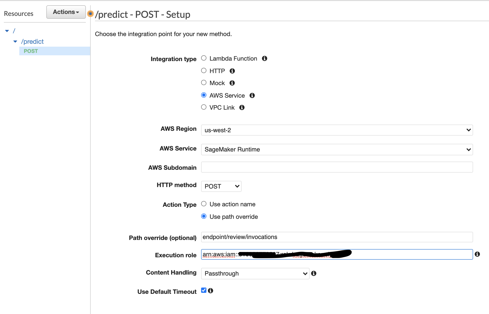
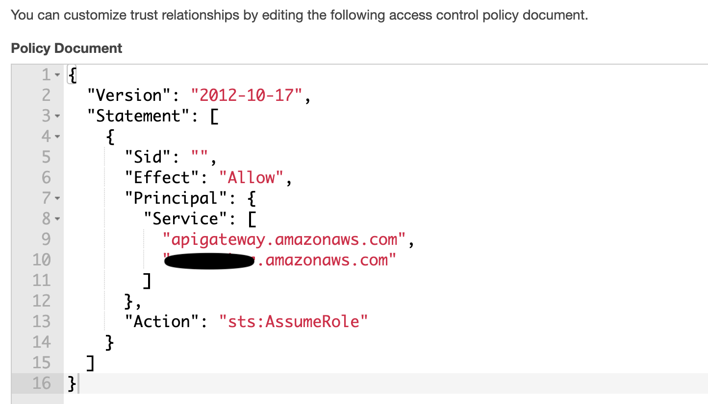

# Sagemaker bring-your-own-inference

This repository shows a step-by-step approach on how to serve your own model by running your own
inference code with Sagemaker. Examples are in python3.

#python3 #sagemaker #ecr #bring-your-own-model #ngnix #gunicorn #flask #tensorflow #keras #docker

## 1. Model training

We use the [keras model](https://keras.io/examples/nlp/text_classification_with_transformer/) on "text classification with movie reviews" as an exmaple model. The dataset is a collection of movie reviews labelled by sentiment (positive or negative). More details on the training data can be found [here](https://keras.io/api/datasets/imdb/)

First, run the training script to train the model. The trained model is saved into the `artifact` directory.

```
$ python train/train.py

25000 Training sequences
25000 Validation sequences
(25000, 200) (25000,)
Train on 25000 samples, validate on 25000 samples
Epoch 1/2
25000/25000 [==============================] - 160s 6ms/sample - loss: 0.3878 - accuracy: 0.8169 - val_loss: 0.2891 - val_accuracy: 0.8778
Epoch 2/2
25000/25000 [==============================] - 154s 6ms/sample - loss: 0.2016 - accuracy: 0.9235 - val_loss: 0.3100 - val_accuracy: 0.8736
```

Quickly test the model loading and prediction locally with a few input from the training data.

```
$ python train/test_predict.py

1 tf.Tensor([[0.00335662 0.9966434 ]], shape=(1, 2), dtype=float32)
0 tf.Tensor([[0.9963476  0.00365242]], shape=(1, 2), dtype=float32)
0 tf.Tensor([[0.99509156 0.00490841]], shape=(1, 2), dtype=float32)

```

Next, copy the trained model `artifact` into the `serve` directory where we keep all the files needed in a docker container.

```
 $ cp -R train/artifact serve/artifact
```

## 2. Prepare docker container

There are a few things in the docker container, all under the `serve` directory.

- `sagemaker.py`: a flask app that serves 2 endpoints, `[POST]/invocation` and `[GET]/ping`. These 2 endpoints are mandated by the [Sagemaker](https://docs.aws.amazon.com/sagemaker/latest/dg/your-algorithms-inference-code.html).

- `artifact`: the model created by the previous training step. `sagemaker.py` loads this model on startup.

- `nginx.conf`: a configuration file for the nginx server. [The official guide](https://docs.gunicorn.org/en/stable/deploy.html) of Gunicorn recommands using a reverse proxy in front of the Gunicorn.

- `serve`: a python executable that connects "nginx -> gunicorn -> flask app" together. It needs to be an executable but not a `*.py` because Sagemaker [runs the container](https://docs.aws.amazon.com/sagemaker/latest/dg/your-algorithms-inference-code.html) as `docker run ${image} serve`.

In this step, we build a docker image, serve it locally, and invoke the endpoints to verify everything works as expected:

```
$ docker build -t review:latest .
$ docker run -p 8080:8080 --rm review:latest serve
$ python local_test/request.py

<Response [200]>
[[0.28757980465888977, 0.7124201655387878]]
```

## 3. Configure Sagemaker

There are 3 parts in this step.

1. push the docker image into [ECR](https://aws.amazon.com/ecr/) or an equivalent docker registry.

2. create the Sagemaker model and endpoint.

3. testing and verification.


First, we push the docker image into ECR. It will be later retrieved by the Sagemaker to run as a web service.

```
$ ./create_image.sh review
```

After that, we run a bunch of aws-cli commands to create Sagemaker model, endpoint config and endpoint.

```
$ ./create_model.sh review
```

It takes a while for the model to be fully created and the endpoint to be fully up. The creation status can be checked in AWS console.

Once the model and the endpoint are fully created, we can create an API Gateway resource to test it out. The configuration is given in the screenshot below. Note that the given Execution role needs to have a trust relationship to API Gateway.



(Trust relationship settings)


With all that, we are able to call the sagemaker endpoint from the API Gateway and get inference result.

## References:

1. [Amazon SageMaker Examples](https://github.com/awslabs/amazon-sagemaker-examples)